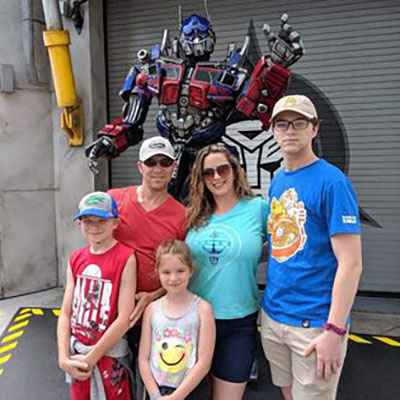
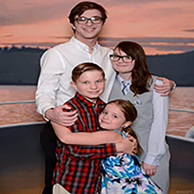
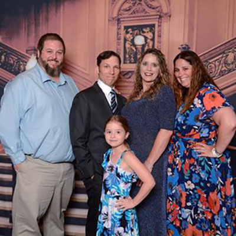
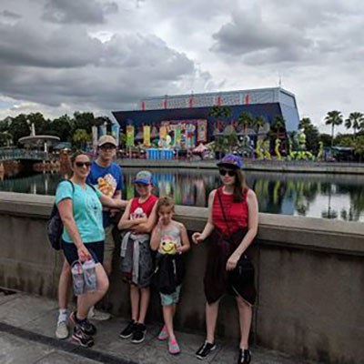
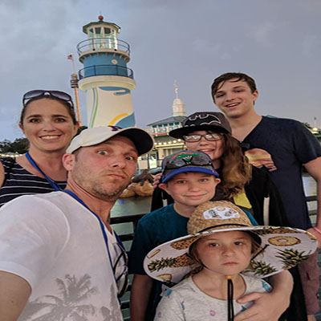
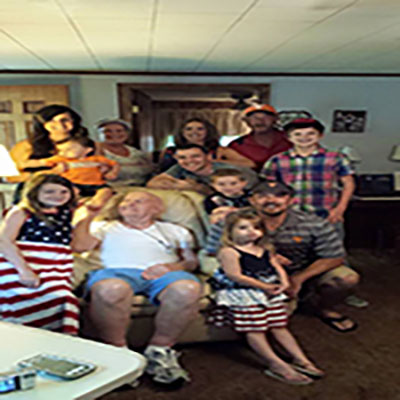
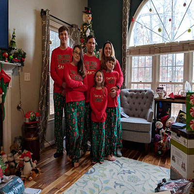

<!DOCTYPE html>
<html lang="en">
  <head>
    <meta charset="utf-8">
    <meta http-equiv="X-UA-Compatible" content="IE=edge">
    <meta name="viewport" content="width=device-width, initial-scale=1">
    <title>Morgan Family</title>
    <!-- Bootstrap -->
    <link href="bootstrap-4.4.1.css" rel="stylesheet">
    <link href="favoritestyles1.com.css" rel="stylesheet" type="text/css">
  <meta name="description" content="Morgan Family- add description here">
  </head>
  <body>
  <nav class="navbar navbar-expand-lg navbar-dark bg-dark"> <a class="navbar-brand" href="#">Morgan Family</a>
    <button class="navbar-toggler" type="button" data-toggle="collapse" data-target="#navbarSupportedContent" aria-controls="navbarSupportedContent" aria-expanded="false" aria-label="Toggle navigation">  </button>
    

      <ul class="navbar-nav mr-auto">
        <li class="nav-item"> <a class="nav-link" href="../index.html">Home (current)</a> </li>
        <li class="nav-item"> <a class="nav-link" href="matt.html">Matt</a> </li>
        <li class="nav-item"> <a class="nav-link" href="heather.html">Heather</a></li>
        <li class="nav-item"><a href="Mason.html" class="nav-link">Mason</a>
        <li class="nav-item"><a href="Cepe.html" class="nav-link">Cepe</a>
        <li class="nav-item"><a href="Tanner.html" class="nav-link">Tanner</a>
        <li class="nav-item"><a href="Olivia.html" class="nav-link">Olivia</a>
        <li class="nav-item"><a href="Morgan-blog.html" class="nav-link">Morgan Blog&nbsp;</a></li>
      </ul>
    

  </nav>
  <header class="row morganfamily">
    

      <h2>Morgan Family</h2>
    

  </header>
  
<section>
  

        

          

<h2>Family Photos</h2>
            
Meet the family. Here are some of our favorite <a href="Morgan-blog.html">Morgan family</a> photos.

          

        

        

          

            
            <h4>Our favorite family portrait</h4>

          

            
            <h4>Our trip to Universal. Getting our picture taken with Optimus Primer</h4>
            <h6>Summer Trip 2019</h6>
          

        

        

          

          

          

          

        

        

        

          

          

          

          

        

      

  

    <h2 class="text-center">Some Things We Are Up To</h2>
    

      

        <ul>
          <li>Almost four years ago Matt retired from the Navy.&nbsp;</li>
          <li>We moved to Fredericksburg, VA.&nbsp;</li>
          <li>We are slowly remodeling our house. Kids started 11th, 9th, and 5th grades this year.&nbsp;</li>
          <li>We have been enjoying really learning about the history of our new area.&nbsp; </li>
          
<a href="#top">Return to top</a>

        </ul>
      

    

  

    </section>
    

    <section> </section>
    

    

      

        

          

            <h3 class="text-center">Morgan Family</h3>
            
We meet in 1997 and married in 1998. They currently have been married for 23 years. In 2001, we had our first child a son named Mason. We then added a daughter in 2004, another son in 2006 and our last daughter in 2010. We love to travel and see new and exciting adventures. This website will display all the new and exciting adventures we will go on.&nbsp;&nbsp; We stay busy getting family, kids and work stuff done. We do allow some fun in with going to wineries and also doing some neat activities with the kids. On this website you will find updated photos of us and the kids. The <a href="../Morgan-blog.html">Morgan Family Blog</a> will keep you up to date with what we are up to.

          

          

            <h3 class="text-center">GET IN TOUCH</h3>
            <address class="text-center">
            <strong>Morgan Family</strong> 
				6120 New Pembrook Ln,  
				Fredericksburg, VA 22407  
				<a href="mailto:talkativemom2four@gmail.com">talkativemom2four@gmail.com</a>
            </address>
           
          

      

    

    

    <footer>
      

        

          

            
Copyright © Heather Morgan. All rights reserved.

          

        

      

    </footer>
    <!-- jQuery (necessary for Bootstrap's JavaScript plugins) -->
    
    <!-- Include all compiled plugins (below), or include individual files as needed -->
    
    
  </body>
</html>
